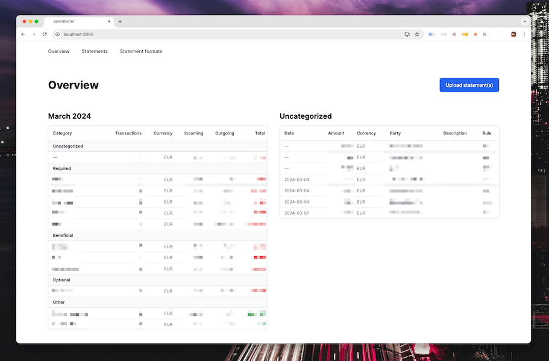

# spendbetter

This is my own simple expense tracker.

It's not finished nor done yet. It's evolving while I'm using it and discovering how I'd like it to behave.

Nevertheless, you are welcome to explore the ideas and take whatever you find useful.

## todo

- [ ] Sufficient test coverage
- [ ] Better readme
- [ ] Walkthrough video
- [ ] Duplicate/overlap handling
- [ ] Dashboard with custom queries
- [ ] Demo environment
